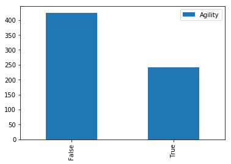

### Questions
* Why is pandas so awesome? 
    * dataframe objects
    * easier to view/manipulate data
    * it helps you interact with data
    * nice plotting/stats methods
    * great method chaining
    * a lot/most/all data scientists use it

* What does pandas stand for? 
    * “Python Data Analysis Library
    
* Pivot tables lab, how to flatten heirarchical index

### Objectives
YWBAT 
* know and apply strategies for handling null values
* know and apply strategies for handling placeholders
* \*apply strategies for normalizing and standardizing data

### Outline
* Questions
* Load in our data and clean it
* Create some new columns
* Create columns using both tables


```python
import pandas as pd
import numpy as np

import matplotlib.pyplot as plt
import seaborn as sns
```

### Loading in super hero powers


```python
df = pd.read_csv("super_hero_powers.csv")
df.head()
```


<div>
<style scoped>
    .dataframe tbody tr th:only-of-type {
        vertical-align: middle;
    }

    .dataframe tbody tr th {
        vertical-align: top;
    }

    .dataframe thead th {
        text-align: right;
    }
</style>
<table border="1" class="dataframe">
  <thead>
    <tr style="text-align: right;">
      <th></th>
      <th>hero_names</th>
      <th>Agility</th>
      <th>Accelerated Healing</th>
      <th>Lantern Power Ring</th>
      <th>Dimensional Awareness</th>
      <th>Cold Resistance</th>
      <th>Durability</th>
      <th>Stealth</th>
      <th>Energy Absorption</th>
      <th>Flight</th>
      <th>...</th>
      <th>Web Creation</th>
      <th>Reality Warping</th>
      <th>Odin Force</th>
      <th>Symbiote Costume</th>
      <th>Speed Force</th>
      <th>Phoenix Force</th>
      <th>Molecular Dissipation</th>
      <th>Vision - Cryo</th>
      <th>Omnipresent</th>
      <th>Omniscient</th>
    </tr>
  </thead>
  <tbody>
    <tr>
      <td>0</td>
      <td>3-D Man</td>
      <td>True</td>
      <td>False</td>
      <td>False</td>
      <td>False</td>
      <td>False</td>
      <td>False</td>
      <td>False</td>
      <td>False</td>
      <td>False</td>
      <td>...</td>
      <td>False</td>
      <td>False</td>
      <td>False</td>
      <td>False</td>
      <td>False</td>
      <td>False</td>
      <td>False</td>
      <td>False</td>
      <td>False</td>
      <td>False</td>
    </tr>
    <tr>
      <td>1</td>
      <td>A-Bomb</td>
      <td>False</td>
      <td>True</td>
      <td>False</td>
      <td>False</td>
      <td>False</td>
      <td>True</td>
      <td>False</td>
      <td>False</td>
      <td>False</td>
      <td>...</td>
      <td>False</td>
      <td>False</td>
      <td>False</td>
      <td>False</td>
      <td>False</td>
      <td>False</td>
      <td>False</td>
      <td>False</td>
      <td>False</td>
      <td>False</td>
    </tr>
    <tr>
      <td>2</td>
      <td>Abe Sapien</td>
      <td>True</td>
      <td>True</td>
      <td>False</td>
      <td>False</td>
      <td>True</td>
      <td>True</td>
      <td>False</td>
      <td>False</td>
      <td>False</td>
      <td>...</td>
      <td>False</td>
      <td>False</td>
      <td>False</td>
      <td>False</td>
      <td>False</td>
      <td>False</td>
      <td>False</td>
      <td>False</td>
      <td>False</td>
      <td>False</td>
    </tr>
    <tr>
      <td>3</td>
      <td>Abin Sur</td>
      <td>False</td>
      <td>False</td>
      <td>True</td>
      <td>False</td>
      <td>False</td>
      <td>False</td>
      <td>False</td>
      <td>False</td>
      <td>False</td>
      <td>...</td>
      <td>False</td>
      <td>False</td>
      <td>False</td>
      <td>False</td>
      <td>False</td>
      <td>False</td>
      <td>False</td>
      <td>False</td>
      <td>False</td>
      <td>False</td>
    </tr>
    <tr>
      <td>4</td>
      <td>Abomination</td>
      <td>False</td>
      <td>True</td>
      <td>False</td>
      <td>False</td>
      <td>False</td>
      <td>False</td>
      <td>False</td>
      <td>False</td>
      <td>False</td>
      <td>...</td>
      <td>False</td>
      <td>False</td>
      <td>False</td>
      <td>False</td>
      <td>False</td>
      <td>False</td>
      <td>False</td>
      <td>False</td>
      <td>False</td>
      <td>False</td>
    </tr>
  </tbody>
</table>
<p>5 rows × 168 columns</p>
</div>


```python
# let's run a conditional on the dtype
df["Agility"].dtype == bool # this returns a pandas Series
```


    True


```python
# let's make a loop to find boolean columns
bool_cols = []
for column in df.columns:
    if df[column].dtype == bool:
        bool_cols.append(column)
        
df[bool_cols].head()
```


<div>
<style scoped>
    .dataframe tbody tr th:only-of-type {
        vertical-align: middle;
    }

    .dataframe tbody tr th {
        vertical-align: top;
    }

    .dataframe thead th {
        text-align: right;
    }
</style>
<table border="1" class="dataframe">
  <thead>
    <tr style="text-align: right;">
      <th></th>
      <th>Agility</th>
      <th>Accelerated Healing</th>
      <th>Lantern Power Ring</th>
      <th>Dimensional Awareness</th>
      <th>Cold Resistance</th>
      <th>Durability</th>
      <th>Stealth</th>
      <th>Energy Absorption</th>
      <th>Flight</th>
      <th>Danger Sense</th>
      <th>...</th>
      <th>Web Creation</th>
      <th>Reality Warping</th>
      <th>Odin Force</th>
      <th>Symbiote Costume</th>
      <th>Speed Force</th>
      <th>Phoenix Force</th>
      <th>Molecular Dissipation</th>
      <th>Vision - Cryo</th>
      <th>Omnipresent</th>
      <th>Omniscient</th>
    </tr>
  </thead>
  <tbody>
    <tr>
      <td>0</td>
      <td>True</td>
      <td>False</td>
      <td>False</td>
      <td>False</td>
      <td>False</td>
      <td>False</td>
      <td>False</td>
      <td>False</td>
      <td>False</td>
      <td>False</td>
      <td>...</td>
      <td>False</td>
      <td>False</td>
      <td>False</td>
      <td>False</td>
      <td>False</td>
      <td>False</td>
      <td>False</td>
      <td>False</td>
      <td>False</td>
      <td>False</td>
    </tr>
    <tr>
      <td>1</td>
      <td>False</td>
      <td>True</td>
      <td>False</td>
      <td>False</td>
      <td>False</td>
      <td>True</td>
      <td>False</td>
      <td>False</td>
      <td>False</td>
      <td>False</td>
      <td>...</td>
      <td>False</td>
      <td>False</td>
      <td>False</td>
      <td>False</td>
      <td>False</td>
      <td>False</td>
      <td>False</td>
      <td>False</td>
      <td>False</td>
      <td>False</td>
    </tr>
    <tr>
      <td>2</td>
      <td>True</td>
      <td>True</td>
      <td>False</td>
      <td>False</td>
      <td>True</td>
      <td>True</td>
      <td>False</td>
      <td>False</td>
      <td>False</td>
      <td>False</td>
      <td>...</td>
      <td>False</td>
      <td>False</td>
      <td>False</td>
      <td>False</td>
      <td>False</td>
      <td>False</td>
      <td>False</td>
      <td>False</td>
      <td>False</td>
      <td>False</td>
    </tr>
    <tr>
      <td>3</td>
      <td>False</td>
      <td>False</td>
      <td>True</td>
      <td>False</td>
      <td>False</td>
      <td>False</td>
      <td>False</td>
      <td>False</td>
      <td>False</td>
      <td>False</td>
      <td>...</td>
      <td>False</td>
      <td>False</td>
      <td>False</td>
      <td>False</td>
      <td>False</td>
      <td>False</td>
      <td>False</td>
      <td>False</td>
      <td>False</td>
      <td>False</td>
    </tr>
    <tr>
      <td>4</td>
      <td>False</td>
      <td>True</td>
      <td>False</td>
      <td>False</td>
      <td>False</td>
      <td>False</td>
      <td>False</td>
      <td>False</td>
      <td>False</td>
      <td>False</td>
      <td>...</td>
      <td>False</td>
      <td>False</td>
      <td>False</td>
      <td>False</td>
      <td>False</td>
      <td>False</td>
      <td>False</td>
      <td>False</td>
      <td>False</td>
      <td>False</td>
    </tr>
  </tbody>
</table>
<p>5 rows × 167 columns</p>
</div>


```python
# calculate the nulls in Agility
df["Agility"].isna().sum()
```


    0


```python
# print columns with null values
for column in df.columns:
    if df[column].isna().sum() > 0:
        print(column)
```


```python
agility_series = 
```


```python
# loop through all bool columns and print a bar chart
for index, column in enumerate(bool_cols):
    my_series = df[column].value_counts()
    plt.figure(figsize=(8, 5))
    plt.grid(zorder=0)
    plt.bar(my_series.index, my_series.values, zorder=2, alpha=0.7)
    plt.xticks(my_series.index, my_series.index)
    plt.title(column)
    plt.show()
    if index==5:
        break
```


```python
counts = pd.DataFrame(df["Agility"].value_counts())
counts.plot(kind='bar')
```


    <matplotlib.axes._subplots.AxesSubplot at 0x1a1e1f1ef0>





### let's find all the powers of a particular super-hero


```python
x = df.loc[df.hero_names=="Abe Sapien"]
x.T
```


<div>
<style scoped>
    .dataframe tbody tr th:only-of-type {
        vertical-align: middle;
    }

    .dataframe tbody tr th {
        vertical-align: top;
    }

    .dataframe thead th {
        text-align: right;
    }
</style>
<table border="1" class="dataframe">
  <thead>
    <tr style="text-align: right;">
      <th></th>
      <th>2</th>
    </tr>
  </thead>
  <tbody>
    <tr>
      <td>hero_names</td>
      <td>Abe Sapien</td>
    </tr>
    <tr>
      <td>Agility</td>
      <td>True</td>
    </tr>
    <tr>
      <td>Accelerated Healing</td>
      <td>True</td>
    </tr>
    <tr>
      <td>Lantern Power Ring</td>
      <td>False</td>
    </tr>
    <tr>
      <td>Dimensional Awareness</td>
      <td>False</td>
    </tr>
    <tr>
      <td>...</td>
      <td>...</td>
    </tr>
    <tr>
      <td>Phoenix Force</td>
      <td>False</td>
    </tr>
    <tr>
      <td>Molecular Dissipation</td>
      <td>False</td>
    </tr>
    <tr>
      <td>Vision - Cryo</td>
      <td>False</td>
    </tr>
    <tr>
      <td>Omnipresent</td>
      <td>False</td>
    </tr>
    <tr>
      <td>Omniscient</td>
      <td>False</td>
    </tr>
  </tbody>
</table>
<p>168 rows × 1 columns</p>
</div>


### Load in heros_information.csv


```python
df2 = pd.read_csv("heroes_information.csv", index_col=0)
df2.head()
```


<div>
<style scoped>
    .dataframe tbody tr th:only-of-type {
        vertical-align: middle;
    }

    .dataframe tbody tr th {
        vertical-align: top;
    }

    .dataframe thead th {
        text-align: right;
    }
</style>
<table border="1" class="dataframe">
  <thead>
    <tr style="text-align: right;">
      <th></th>
      <th>name</th>
      <th>Gender</th>
      <th>Eye color</th>
      <th>Race</th>
      <th>Hair color</th>
      <th>Height</th>
      <th>Publisher</th>
      <th>Skin color</th>
      <th>Alignment</th>
      <th>Weight</th>
    </tr>
  </thead>
  <tbody>
    <tr>
      <td>0</td>
      <td>A-Bomb</td>
      <td>Male</td>
      <td>yellow</td>
      <td>Human</td>
      <td>No Hair</td>
      <td>203.0</td>
      <td>Marvel Comics</td>
      <td>-</td>
      <td>good</td>
      <td>441.0</td>
    </tr>
    <tr>
      <td>1</td>
      <td>Abe Sapien</td>
      <td>Male</td>
      <td>blue</td>
      <td>Icthyo Sapien</td>
      <td>No Hair</td>
      <td>191.0</td>
      <td>Dark Horse Comics</td>
      <td>blue</td>
      <td>good</td>
      <td>65.0</td>
    </tr>
    <tr>
      <td>2</td>
      <td>Abin Sur</td>
      <td>Male</td>
      <td>blue</td>
      <td>Ungaran</td>
      <td>No Hair</td>
      <td>185.0</td>
      <td>DC Comics</td>
      <td>red</td>
      <td>good</td>
      <td>90.0</td>
    </tr>
    <tr>
      <td>3</td>
      <td>Abomination</td>
      <td>Male</td>
      <td>green</td>
      <td>Human / Radiation</td>
      <td>No Hair</td>
      <td>203.0</td>
      <td>Marvel Comics</td>
      <td>-</td>
      <td>bad</td>
      <td>441.0</td>
    </tr>
    <tr>
      <td>4</td>
      <td>Abraxas</td>
      <td>Male</td>
      <td>blue</td>
      <td>Cosmic Entity</td>
      <td>Black</td>
      <td>-99.0</td>
      <td>Marvel Comics</td>
      <td>-</td>
      <td>bad</td>
      <td>-99.0</td>
    </tr>
  </tbody>
</table>
</div>


```python
df2.info()

# object -> strings, dictionaries
```

    <class 'pandas.core.frame.DataFrame'>
    Int64Index: 734 entries, 0 to 733
    Data columns (total 10 columns):
    name          734 non-null object
    Gender        734 non-null object
    Eye color     734 non-null object
    Race          734 non-null object
    Hair color    734 non-null object
    Height        734 non-null float64
    Publisher     719 non-null object
    Skin color    734 non-null object
    Alignment     734 non-null object
    Weight        732 non-null float64
    dtypes: float64(2), object(8)
    memory usage: 63.1+ KB


```python
df2.isna().sum()
```


    name           0
    Gender         0
    Eye color      0
    Race           0
    Hair color     0
    Height         0
    Publisher     15
    Skin color     0
    Alignment      0
    Weight         2
    dtype: int64


```python
# there are only 15, so you might have to fill these in by hand

df2[df2.Publisher.isna()==True].head()
```


<div>
<style scoped>
    .dataframe tbody tr th:only-of-type {
        vertical-align: middle;
    }

    .dataframe tbody tr th {
        vertical-align: top;
    }

    .dataframe thead th {
        text-align: right;
    }
</style>
<table border="1" class="dataframe">
  <thead>
    <tr style="text-align: right;">
      <th></th>
      <th>name</th>
      <th>Gender</th>
      <th>Eye color</th>
      <th>Race</th>
      <th>Hair color</th>
      <th>Height</th>
      <th>Publisher</th>
      <th>Skin color</th>
      <th>Alignment</th>
      <th>Weight</th>
    </tr>
  </thead>
  <tbody>
    <tr>
      <td>46</td>
      <td>Astro Boy</td>
      <td>Male</td>
      <td>brown</td>
      <td>-</td>
      <td>Black</td>
      <td>-99.0</td>
      <td>NaN</td>
      <td>-</td>
      <td>good</td>
      <td>-99.0</td>
    </tr>
    <tr>
      <td>86</td>
      <td>Bionic Woman</td>
      <td>Female</td>
      <td>blue</td>
      <td>Cyborg</td>
      <td>Black</td>
      <td>-99.0</td>
      <td>NaN</td>
      <td>-</td>
      <td>good</td>
      <td>-99.0</td>
    </tr>
    <tr>
      <td>138</td>
      <td>Brundlefly</td>
      <td>Male</td>
      <td>-</td>
      <td>Mutant</td>
      <td>-</td>
      <td>193.0</td>
      <td>NaN</td>
      <td>-</td>
      <td>-</td>
      <td>-99.0</td>
    </tr>
    <tr>
      <td>175</td>
      <td>Chuck Norris</td>
      <td>Male</td>
      <td>-</td>
      <td>-</td>
      <td>-</td>
      <td>178.0</td>
      <td>NaN</td>
      <td>-</td>
      <td>good</td>
      <td>-99.0</td>
    </tr>
    <tr>
      <td>204</td>
      <td>Darkside</td>
      <td>-</td>
      <td>-</td>
      <td>-</td>
      <td>-</td>
      <td>-99.0</td>
      <td>NaN</td>
      <td>-</td>
      <td>bad</td>
      <td>-99.0</td>
    </tr>
  </tbody>
</table>
</div>


```python
# let's fill a null value in the publisher column
# Let's fill in null value for Darkside's Publisher with DC Comics

# fill in null value by hand
df2.loc[df2.name=='Darkside', ['Publisher']] = "DC Comics"

# checking if it's filled
df2.loc[df2.name=='Darkside']
```


<div>
<style scoped>
    .dataframe tbody tr th:only-of-type {
        vertical-align: middle;
    }

    .dataframe tbody tr th {
        vertical-align: top;
    }

    .dataframe thead th {
        text-align: right;
    }
</style>
<table border="1" class="dataframe">
  <thead>
    <tr style="text-align: right;">
      <th></th>
      <th>name</th>
      <th>Gender</th>
      <th>Eye color</th>
      <th>Race</th>
      <th>Hair color</th>
      <th>Height</th>
      <th>Publisher</th>
      <th>Skin color</th>
      <th>Alignment</th>
      <th>Weight</th>
    </tr>
  </thead>
  <tbody>
    <tr>
      <td>204</td>
      <td>Darkside</td>
      <td>-</td>
      <td>-</td>
      <td>-</td>
      <td>-</td>
      <td>-99.0</td>
      <td>DC Comics</td>
      <td>-</td>
      <td>bad</td>
      <td>-99.0</td>
    </tr>
  </tbody>
</table>
</div>


```python
# how do we drop rows with null values in publisher?

df2_publisher = df2.dropna(how='any', axis=0, subset=["Publisher"])
df2.shape, df2_publisher.shape # we should see a difference of 14
```


    ((734, 10), (720, 10))


```python
# What should we do with our '-'

df2.Gender = df2.Gender.replace(to_replace="-", value=np.nan)
df2.Gender.value_counts()
```


    Male      505
    Female    200
    Name: Gender, dtype: int64


### Replacing placeholders in a single line


```python
df2 = df2.replace(to_replace="-", value=np.nan)
df2.head()
```


<div>
<style scoped>
    .dataframe tbody tr th:only-of-type {
        vertical-align: middle;
    }

    .dataframe tbody tr th {
        vertical-align: top;
    }

    .dataframe thead th {
        text-align: right;
    }
</style>
<table border="1" class="dataframe">
  <thead>
    <tr style="text-align: right;">
      <th></th>
      <th>name</th>
      <th>Gender</th>
      <th>Eye color</th>
      <th>Race</th>
      <th>Hair color</th>
      <th>Height</th>
      <th>Publisher</th>
      <th>Skin color</th>
      <th>Alignment</th>
      <th>Weight</th>
    </tr>
  </thead>
  <tbody>
    <tr>
      <td>0</td>
      <td>A-Bomb</td>
      <td>Male</td>
      <td>yellow</td>
      <td>Human</td>
      <td>No Hair</td>
      <td>203.0</td>
      <td>Marvel Comics</td>
      <td>NaN</td>
      <td>good</td>
      <td>441.0</td>
    </tr>
    <tr>
      <td>1</td>
      <td>Abe Sapien</td>
      <td>Male</td>
      <td>blue</td>
      <td>Icthyo Sapien</td>
      <td>No Hair</td>
      <td>191.0</td>
      <td>Dark Horse Comics</td>
      <td>blue</td>
      <td>good</td>
      <td>65.0</td>
    </tr>
    <tr>
      <td>2</td>
      <td>Abin Sur</td>
      <td>Male</td>
      <td>blue</td>
      <td>Ungaran</td>
      <td>No Hair</td>
      <td>185.0</td>
      <td>DC Comics</td>
      <td>red</td>
      <td>good</td>
      <td>90.0</td>
    </tr>
    <tr>
      <td>3</td>
      <td>Abomination</td>
      <td>Male</td>
      <td>green</td>
      <td>Human / Radiation</td>
      <td>No Hair</td>
      <td>203.0</td>
      <td>Marvel Comics</td>
      <td>NaN</td>
      <td>bad</td>
      <td>441.0</td>
    </tr>
    <tr>
      <td>4</td>
      <td>Abraxas</td>
      <td>Male</td>
      <td>blue</td>
      <td>Cosmic Entity</td>
      <td>Black</td>
      <td>-99.0</td>
      <td>Marvel Comics</td>
      <td>NaN</td>
      <td>bad</td>
      <td>-99.0</td>
    </tr>
  </tbody>
</table>
</div>


```python

```


```python

```


```python
df2[df2.Height==-99].head()
```


<div>
<style scoped>
    .dataframe tbody tr th:only-of-type {
        vertical-align: middle;
    }

    .dataframe tbody tr th {
        vertical-align: top;
    }

    .dataframe thead th {
        text-align: right;
    }
</style>
<table border="1" class="dataframe">
  <thead>
    <tr style="text-align: right;">
      <th></th>
      <th>name</th>
      <th>Gender</th>
      <th>Eye color</th>
      <th>Race</th>
      <th>Hair color</th>
      <th>Height</th>
      <th>Publisher</th>
      <th>Skin color</th>
      <th>Alignment</th>
      <th>Weight</th>
    </tr>
  </thead>
  <tbody>
    <tr>
      <td>4</td>
      <td>Abraxas</td>
      <td>Male</td>
      <td>blue</td>
      <td>Cosmic Entity</td>
      <td>Black</td>
      <td>-99.0</td>
      <td>Marvel Comics</td>
      <td>NaN</td>
      <td>bad</td>
      <td>-99.0</td>
    </tr>
    <tr>
      <td>6</td>
      <td>Adam Monroe</td>
      <td>Male</td>
      <td>blue</td>
      <td>NaN</td>
      <td>Blond</td>
      <td>-99.0</td>
      <td>NBC - Heroes</td>
      <td>NaN</td>
      <td>good</td>
      <td>-99.0</td>
    </tr>
    <tr>
      <td>14</td>
      <td>Alex Mercer</td>
      <td>Male</td>
      <td>NaN</td>
      <td>Human</td>
      <td>NaN</td>
      <td>-99.0</td>
      <td>Wildstorm</td>
      <td>NaN</td>
      <td>bad</td>
      <td>-99.0</td>
    </tr>
    <tr>
      <td>15</td>
      <td>Alex Woolsly</td>
      <td>Male</td>
      <td>NaN</td>
      <td>NaN</td>
      <td>NaN</td>
      <td>-99.0</td>
      <td>NBC - Heroes</td>
      <td>NaN</td>
      <td>good</td>
      <td>-99.0</td>
    </tr>
    <tr>
      <td>18</td>
      <td>Allan Quatermain</td>
      <td>Male</td>
      <td>NaN</td>
      <td>NaN</td>
      <td>NaN</td>
      <td>-99.0</td>
      <td>Wildstorm</td>
      <td>NaN</td>
      <td>good</td>
      <td>-99.0</td>
    </tr>
  </tbody>
</table>
</div>


```python
df2.replace(to_replace=-99.0, value=np.nan, inplace=True)
```


```python

```


```python

```


```python
df2["Skin color"].replace(to_replace="-", value=np.nan, inplace=True)
```


```python
df2["Gender"].replace(to_replace="-", value=np.nan, inplace=True)
```


```python
df2["Eye color"].replace(to_replace="-", value=np.nan, inplace=True)
```


```python
df2["Race"].replace(to_replace="-", value=np.nan, inplace=True)
```


```python
df2["Hair color"].replace(to_replace="-", value=np.nan, inplace=True)
```


```python
df2["Alignment"].replace(to_replace="-", value=np.nan, inplace=True)
```

### or apply replace to entire dataframe


```python
df2.replace(to_replace=["-", -99.0], value=np.nan, inplace=True)
```


```python
df2.isnull().sum()
```


    name            0
    Gender         29
    Eye color     172
    Race          304
    Hair color    172
    Height        217
    Publisher      14
    Skin color    662
    Alignment       7
    Weight        239
    dtype: int64


```python
df2.head()
```


<div>
<style scoped>
    .dataframe tbody tr th:only-of-type {
        vertical-align: middle;
    }

    .dataframe tbody tr th {
        vertical-align: top;
    }

    .dataframe thead th {
        text-align: right;
    }
</style>
<table border="1" class="dataframe">
  <thead>
    <tr style="text-align: right;">
      <th></th>
      <th>name</th>
      <th>Gender</th>
      <th>Eye color</th>
      <th>Race</th>
      <th>Hair color</th>
      <th>Height</th>
      <th>Publisher</th>
      <th>Skin color</th>
      <th>Alignment</th>
      <th>Weight</th>
    </tr>
  </thead>
  <tbody>
    <tr>
      <th>0</th>
      <td>A-Bomb</td>
      <td>Male</td>
      <td>yellow</td>
      <td>Human</td>
      <td>No Hair</td>
      <td>203.0</td>
      <td>Marvel Comics</td>
      <td>NaN</td>
      <td>good</td>
      <td>441.0</td>
    </tr>
    <tr>
      <th>1</th>
      <td>Abe Sapien</td>
      <td>Male</td>
      <td>blue</td>
      <td>Icthyo Sapien</td>
      <td>No Hair</td>
      <td>191.0</td>
      <td>Dark Horse Comics</td>
      <td>blue</td>
      <td>good</td>
      <td>65.0</td>
    </tr>
    <tr>
      <th>2</th>
      <td>Abin Sur</td>
      <td>Male</td>
      <td>blue</td>
      <td>Ungaran</td>
      <td>No Hair</td>
      <td>185.0</td>
      <td>DC Comics</td>
      <td>red</td>
      <td>good</td>
      <td>90.0</td>
    </tr>
    <tr>
      <th>3</th>
      <td>Abomination</td>
      <td>Male</td>
      <td>green</td>
      <td>Human / Radiation</td>
      <td>No Hair</td>
      <td>203.0</td>
      <td>Marvel Comics</td>
      <td>NaN</td>
      <td>bad</td>
      <td>441.0</td>
    </tr>
    <tr>
      <th>4</th>
      <td>Abraxas</td>
      <td>Male</td>
      <td>blue</td>
      <td>Cosmic Entity</td>
      <td>Black</td>
      <td>NaN</td>
      <td>Marvel Comics</td>
      <td>NaN</td>
      <td>bad</td>
      <td>NaN</td>
    </tr>
  </tbody>
</table>
</div>


```python
# rename column pythonically
new_col_name_dict = {}
for col in df2.columns:
    if len(col.split(" ")) > 1:
        new_col = col.lower().replace(" ", "_")
    else:
        new_col = col.lower()
    new_col_name_dict[col] = new_col
new_col_name_dict
```


    {'name': 'name',
     'Gender': 'gender',
     'Eye color': 'eye_color',
     'Race': 'race',
     'Hair color': 'hair_color',
     'Height': 'height',
     'Publisher': 'publisher',
     'Skin color': 'skin_color',
     'Alignment': 'alignment',
     'Weight': 'weight'}


```python
# let's pass this dictionary in to rename our columns

df2.rename(mapper=new_col_name_dict, axis=1, inplace=True)
df2.head()
```


<div>
<style scoped>
    .dataframe tbody tr th:only-of-type {
        vertical-align: middle;
    }

    .dataframe tbody tr th {
        vertical-align: top;
    }

    .dataframe thead th {
        text-align: right;
    }
</style>
<table border="1" class="dataframe">
  <thead>
    <tr style="text-align: right;">
      <th></th>
      <th>name</th>
      <th>gender</th>
      <th>eye_color</th>
      <th>race</th>
      <th>hair_color</th>
      <th>height</th>
      <th>publisher</th>
      <th>skin_color</th>
      <th>alignment</th>
      <th>weight</th>
    </tr>
  </thead>
  <tbody>
    <tr>
      <td>0</td>
      <td>A-Bomb</td>
      <td>Male</td>
      <td>yellow</td>
      <td>Human</td>
      <td>No Hair</td>
      <td>203.0</td>
      <td>Marvel Comics</td>
      <td>NaN</td>
      <td>good</td>
      <td>441.0</td>
    </tr>
    <tr>
      <td>1</td>
      <td>Abe Sapien</td>
      <td>Male</td>
      <td>blue</td>
      <td>Icthyo Sapien</td>
      <td>No Hair</td>
      <td>191.0</td>
      <td>Dark Horse Comics</td>
      <td>blue</td>
      <td>good</td>
      <td>65.0</td>
    </tr>
    <tr>
      <td>2</td>
      <td>Abin Sur</td>
      <td>Male</td>
      <td>blue</td>
      <td>Ungaran</td>
      <td>No Hair</td>
      <td>185.0</td>
      <td>DC Comics</td>
      <td>red</td>
      <td>good</td>
      <td>90.0</td>
    </tr>
    <tr>
      <td>3</td>
      <td>Abomination</td>
      <td>Male</td>
      <td>green</td>
      <td>Human / Radiation</td>
      <td>No Hair</td>
      <td>203.0</td>
      <td>Marvel Comics</td>
      <td>NaN</td>
      <td>bad</td>
      <td>441.0</td>
    </tr>
    <tr>
      <td>4</td>
      <td>Abraxas</td>
      <td>Male</td>
      <td>blue</td>
      <td>Cosmic Entity</td>
      <td>Black</td>
      <td>NaN</td>
      <td>Marvel Comics</td>
      <td>NaN</td>
      <td>bad</td>
      <td>NaN</td>
    </tr>
  </tbody>
</table>
</div>


```python

```


```python

```


```python

```


```python

```


```python

```

### Let's make a column with superpowers!!!!
* column name = superpowers
* dtype = list
* list populated by strings


```python
df.shape, df2.shape
```


    ((667, 168), (734, 10))


```python
heros = {}
# {hero_name: [list of powers]}
for index, row in df.iterrows():
    powers = []
    for col in row.index[1:]:
        if row[col] == True:
            powers.append(col.lower())
    heros[row.values[0].lower()] = powers
```


```python
# let's add this as a new column
powers_column = []
```


```python
for name in df2.name:
    if name in heros.keys():
        powers_column.append(heros[name])
    else:
        powers_column.append(None)
```


```python
df2["powers_column"] = powers_column
df2.head()
```


<div>
<style scoped>
    .dataframe tbody tr th:only-of-type {
        vertical-align: middle;
    }

    .dataframe tbody tr th {
        vertical-align: top;
    }

    .dataframe thead th {
        text-align: right;
    }
</style>
<table border="1" class="dataframe">
  <thead>
    <tr style="text-align: right;">
      <th></th>
      <th>name</th>
      <th>gender</th>
      <th>eye_color</th>
      <th>race</th>
      <th>hair_color</th>
      <th>height</th>
      <th>publisher</th>
      <th>skin_color</th>
      <th>alignment</th>
      <th>weight</th>
      <th>powers_column</th>
    </tr>
  </thead>
  <tbody>
    <tr>
      <td>0</td>
      <td>A-Bomb</td>
      <td>Male</td>
      <td>yellow</td>
      <td>Human</td>
      <td>No Hair</td>
      <td>203.0</td>
      <td>Marvel Comics</td>
      <td>NaN</td>
      <td>good</td>
      <td>441.0</td>
      <td>None</td>
    </tr>
    <tr>
      <td>1</td>
      <td>Abe Sapien</td>
      <td>Male</td>
      <td>blue</td>
      <td>Icthyo Sapien</td>
      <td>No Hair</td>
      <td>191.0</td>
      <td>Dark Horse Comics</td>
      <td>blue</td>
      <td>good</td>
      <td>65.0</td>
      <td>None</td>
    </tr>
    <tr>
      <td>2</td>
      <td>Abin Sur</td>
      <td>Male</td>
      <td>blue</td>
      <td>Ungaran</td>
      <td>No Hair</td>
      <td>185.0</td>
      <td>DC Comics</td>
      <td>red</td>
      <td>good</td>
      <td>90.0</td>
      <td>None</td>
    </tr>
    <tr>
      <td>3</td>
      <td>Abomination</td>
      <td>Male</td>
      <td>green</td>
      <td>Human / Radiation</td>
      <td>No Hair</td>
      <td>203.0</td>
      <td>Marvel Comics</td>
      <td>NaN</td>
      <td>bad</td>
      <td>441.0</td>
      <td>None</td>
    </tr>
    <tr>
      <td>4</td>
      <td>Abraxas</td>
      <td>Male</td>
      <td>blue</td>
      <td>Cosmic Entity</td>
      <td>Black</td>
      <td>NaN</td>
      <td>Marvel Comics</td>
      <td>NaN</td>
      <td>bad</td>
      <td>NaN</td>
      <td>None</td>
    </tr>
  </tbody>
</table>
</div>


```python
df2["superpowers"] = powers_column
df2.head()
```


<div>
<style scoped>
    .dataframe tbody tr th:only-of-type {
        vertical-align: middle;
    }

    .dataframe tbody tr th {
        vertical-align: top;
    }

    .dataframe thead th {
        text-align: right;
    }
</style>
<table border="1" class="dataframe">
  <thead>
    <tr style="text-align: right;">
      <th></th>
      <th>name</th>
      <th>gender</th>
      <th>eyecolor</th>
      <th>race</th>
      <th>haircolor</th>
      <th>height</th>
      <th>publisher</th>
      <th>alignment</th>
      <th>weight</th>
      <th>superpowers</th>
    </tr>
  </thead>
  <tbody>
    <tr>
      <th>0</th>
      <td>a-bomb</td>
      <td>male</td>
      <td>yellow</td>
      <td>human</td>
      <td>no hair</td>
      <td>203.0</td>
      <td>marvel comics</td>
      <td>good</td>
      <td>441.0</td>
      <td>[accelerated healing, durability, longevity, s...</td>
    </tr>
    <tr>
      <th>1</th>
      <td>abe sapien</td>
      <td>male</td>
      <td>blue</td>
      <td>icthyo sapien</td>
      <td>no hair</td>
      <td>191.0</td>
      <td>dark horse comics</td>
      <td>good</td>
      <td>65.0</td>
      <td>[agility, accelerated healing, cold resistance...</td>
    </tr>
    <tr>
      <th>2</th>
      <td>abin sur</td>
      <td>male</td>
      <td>blue</td>
      <td>ungaran</td>
      <td>no hair</td>
      <td>185.0</td>
      <td>dc comics</td>
      <td>good</td>
      <td>90.0</td>
      <td>[lantern power ring]</td>
    </tr>
    <tr>
      <th>3</th>
      <td>abomination</td>
      <td>male</td>
      <td>green</td>
      <td>human / radiation</td>
      <td>no hair</td>
      <td>203.0</td>
      <td>marvel comics</td>
      <td>bad</td>
      <td>441.0</td>
      <td>[accelerated healing, intelligence, super stre...</td>
    </tr>
    <tr>
      <th>4</th>
      <td>abraxas</td>
      <td>male</td>
      <td>blue</td>
      <td>cosmic entity</td>
      <td>black</td>
      <td>NaN</td>
      <td>marvel comics</td>
      <td>bad</td>
      <td>NaN</td>
      <td>[dimensional awareness, flight, intelligence, ...</td>
    </tr>
  </tbody>
</table>
</div>


### Histogram


```python
males = df2[df2.gender == 'male']
females = df2[df2.gender == 'female']
```


```python
sns.
```


    <matplotlib.axes._subplots.AxesSubplot at 0x10de0a3c8>


```python
def plot_sns_hist(df, col):
    plt.figure(figsize=(8, 5))
    plt.grid()
    sns.distplot(df[col].dropna(), bins=20)
    plt.show()
```


```python
plot_sns_hist(males, 'height')
```


```python
plot_sns_hist(females, 'weight')
```


### Assessment

### What did I learn?
* How to use a for loop to go through all the columns
* Pandas series and using their index, values
* Fibonacci for figure values is a good trick
* Identifying null values
* Use for loops a lot and always put in print statements
* Reiterating 


```python

```
